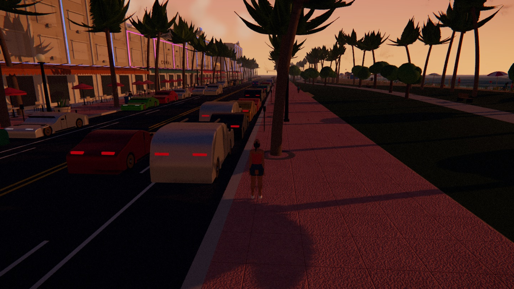
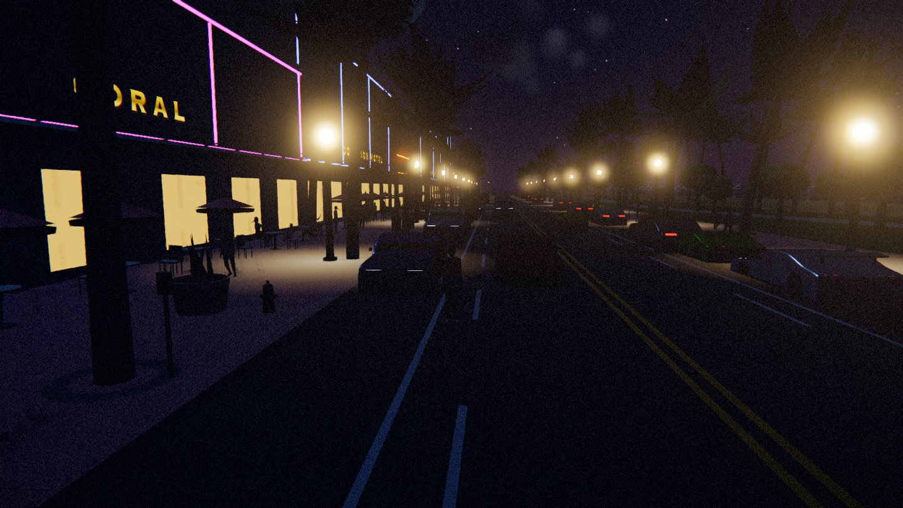
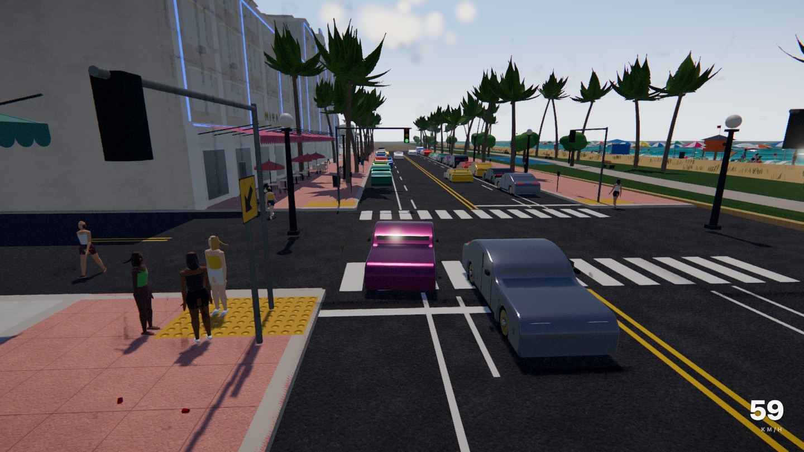
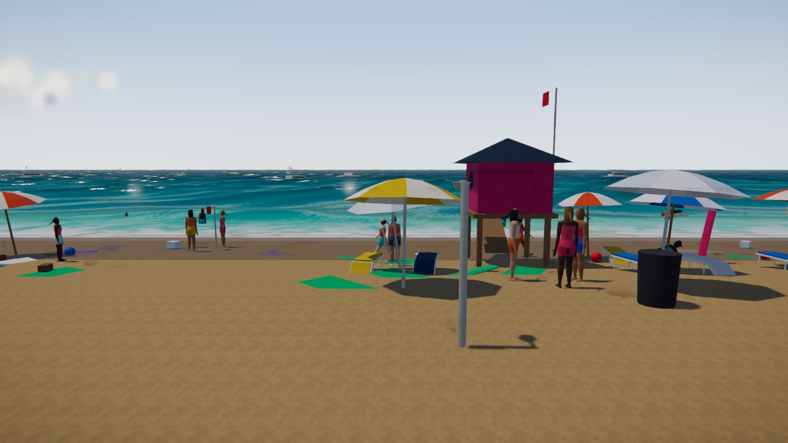
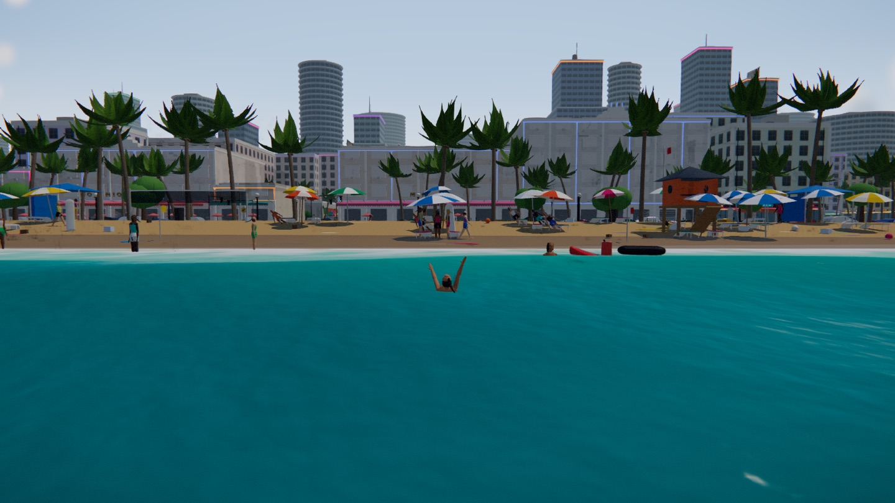
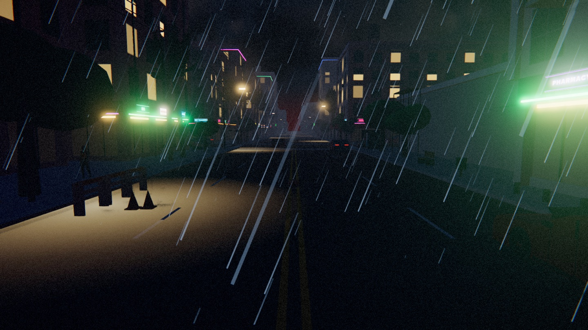
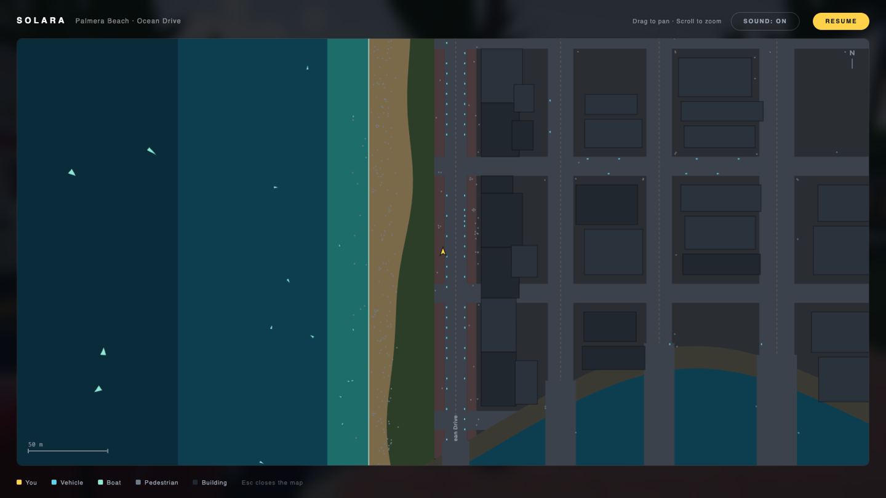

# Solara

An open-world game prototype built with [Three.js](https://threejs.org) and
TypeScript, in which **every asset is generated at runtime from code**. There is
not one model, texture, sound or animation file in the repository — the city,
the coastline, the crowd, the weather and the entire audio bed are built from
primitives, fBm noise and oscillators when the page loads.

You play as **Mara**, starting on the Ocean Drive strip in Palmera Beach. The map
runs from open ocean, across the beach and a green park belt, over Ocean Drive,
and inland through a city of eight avenues — crossed by a river, harbour and
container port — to a downtown of high-rises.



[](LICENSE)


## Quick start

Two commands. There is no backend, no database, no API keys and no configuration
— it is a static front end that runs entirely in the browser.

```bash
npm install
npm run dev          # http://127.0.0.1:5173
```

Then click **Enter Solara**. If mouse look does not engage, click the canvas;
the browser needs a user gesture before it will grant pointer lock.

<details>
<summary>Other commands</summary>

```bash
npm run build        # typecheck, then produce a static bundle in dist/
npm run preview      # serve that production build
npm run typecheck    # tsc --noEmit on its own — the fastest correctness gate
```

`npm run build` emits a plain static site, so any static host will serve it.

</details>

**Requirements.** Node 20+ and a browser with WebGL2 — current Chrome, Edge,
Firefox or Safari. A discrete or recent integrated GPU is recommended: the
project is bounded by draw calls rather than by resolution, and the first load
spends a second or two building textures and baking geometry. There is no mobile
or touch support.

## Screenshots

| | |
| --- | --- |
|  |  |
| **Nightfall on Ocean Drive** — neon, lit interiors and lamp pools, all done by scaling `emissiveIntensity` on shared materials rather than by placing hundreds of lights. | **Driving** — kerbside cars can be entered and driven, with arcade handling, a handbrake slide and a chase camera that settles behind the car. |
|  |  |
| **The beach** — umbrella fields, lounger rows, lifeguard towers and around a hundred beachgoers, most of them baked down to static geometry. | **The ocean** — Gerstner swell with analytic normals, depth-graded colour and a live surf line. Mara wades out and starts swimming past ~1.2 m. |
|  |  |
| **Weather** — five independent continuous dials rather than a list of presets, so any combination is reachable. Thunder is delayed from the flash by the real speed of sound. | **Pause map** — a top-down view drawn from the same layout data the world is built from, with vehicle, boat and pedestrian blips. |

## Controls

**On foot**

| Input | Action |
| --- | --- |
| `W` `A` `S` `D` | Move (camera-relative; Mara turns to face her heading) |
| `Shift` | Sprint |
| `Alt` | Walk slowly |
| `Space` | Jump |
| `F` | Enter the nearest vehicle (within 3.6 m) |
| Mouse | Look (pointer lock) |

**Driving**

| Input | Action |
| --- | --- |
| `W` / `S` | Throttle / brake and reverse |
| `A` `D` | Steer |
| `Space` | Handbrake — hold it into a corner to break traction |
| `F` | Get out (below 3.5 m/s) |
| Mouse | Look around; the view settles back behind the car |

**Swimming and boats**

| Input | Action |
| --- | --- |
| `W` `A` `S` `D` | Swim; she wades out and starts swimming past ~1.2 m depth |
| `Shift` | Swim faster |
| `F` | Board / leave a boat (within 6.5 m) |
| `W` / `S` | Throttle / reverse at the helm |
| `A` `D` | Rudder — boats keep sliding through a turn |

**Map, time and weather**

| Input | Action |
| --- | --- |
| `Esc` or `M` | Open / close the map (freezes the game, frees the cursor) |
| Drag / Scroll | Pan / zoom the map |
| `N` | Mute / unmute (also a button on the map screen) |
| `,` / `.` | Wind the clock back / forward an hour |
| `T` | Freeze or resume the clock |
| `K` | Step through the weather fronts |
| `J` | Hand the weather back to the simulation |

A full day runs in twenty minutes of real time. The clock is shown under the
position readout.

## What's in the build

- **Mara** — an articulated rig of lofted body parts. Proportions follow real
  anthropometry for a 1.68 m woman, keyed off joint heights (hip 0.874, knee
  0.479, shoulder 1.354).
- **Locomotion** — idle / walk / run / jump, all procedural. There is no
  animation clip in the project; every joint angle is evaluated per frame from a
  gait phase that advances with distance actually travelled, which is why the
  feet never skate.
- **Ocean Drive** — a 300 m strip: carriageway, salmon promenade, kerbs, a
  signalised junction with tactile paving, twelve Art Deco blocks (the Dominion
  Hotel front and centre), scalloped awnings, café terraces, palms, parked
  exotics and moving traffic.
- **The city** — eight avenues and fourteen cross streets inland, with grey
  concrete pavements, kerbs, lane markings, cobra-head streetlights, overhead
  power lines, signalised junctions and street trees. Blocks are filled by
  district: mixed-use mid-rise near the coast, then offices, then a downtown of
  glass high-rises and round balconied condo towers. A warehouse district
  carries painted murals. Traffic and pedestrians run the whole grid.
- **The river** — a channel meanders inland from the sea and widens into a
  harbour basin, crossed by a bridge on every avenue. A container port lines one
  bank with gantry cranes, stacked containers and a docked ship; a marina lines
  the other with timber pontoons and piles.
- **The expressway** — an elevated viaduct on concrete piers straddling Bayshore
  Drive, with barriers, overhead sign gantries and its own traffic.
- **Street-level dressing** — bins and wheelie bins, bags of rubbish, litter,
  benches, pavement cafés with parasols, planters and bushes, bikes leaning on
  walls, parking meters, hydrants, signs, and patches of tile, terracotta,
  cobble and asphalt paving so the ground isn't one grey sheet.
- **The park belt** — a green strip between the sand and the promenade whose
  seaward edge wanders, so sand meets grass on a curve rather than a straight
  line. Palms and canopy trees follow it, with a serpentine path, benches, an
  outdoor gym and a basketball court.
- **The beach** — dune and sea oats, then open sand with umbrella fields,
  lounger rows, cabanas, Art Deco lifeguard towers, volleyball, towels, boards
  and around a hundred beachgoers walking, sunbathing, lounging and wading.
- **The ocean** — Gerstner swell with analytic normals, scrolling ripple
  normals, depth-graded colour from turquoise to deep teal, a live surf line and
  whitecaps. Catamarans, motor yachts, runabouts and jet skis are all boardable
  and drivable, and ride the same swell.
- **Crowd** — pedestrians walking, standing in groups and seated at terrace
  tables, each with randomised build, height, colouring and accessories.
- **Time of day and weather** — a full day/night cycle driven from one keyframe
  table, and a continuous weather simulation on five independent dials.
- **Sound** — no music, but a full effects bed, all synthesised at runtime from
  oscillators and noise: rolling surf that tracks your distance from the
  waterline, wind, city rumble, crowd murmur, gulls and distant horns;
  surface-aware footsteps (pavement, sand, grass, splashing shallows); jumps,
  landings, swim strokes; a gear-shifting car engine with tyre scrub and
  collisions; a marine engine with hull wash and wave slams. Everything muffles
  when you go under.

## Project layout

```
src/
  main.ts               bootstrap, render loop, HUD, mode state machine
  core/       input.ts  keyboard + pointer lock;  rng.ts  seeded RNG
  render/     sky.ts    sun, sky, IBL, clouds, shadow rig
              post.ts   AO -> bloom -> grade -> tonemap -> AA
              textures.ts  procedural surface maps (fBm + sobel normals)
              water.ts  the ocean: Gerstner waves, depth colour, surf
              clouds.ts billboard puff clusters, shared by sky and weather
              weather.ts  five continuous dials, folded into the sky state
  audio/      core.ts       context, buses, noise buffers, mute
              ambience.ts   surf, wind, city, crowd, gulls, horns
              player.ts     footsteps, jumps, splashes, swim strokes
              machines.ts   car and boat engines, skid, impacts
              index.ts      the one seam between game and audio
  ui/         map.ts        pause map overlay
  world/      layout.ts     street AND shore geometry, single source of truth
              terrain.ts    beach, dune, seabed and park heightfield
              beach.ts      umbrellas, loungers, towers, cabanas, towels
              city.ts       street grid, districts, towers, expressway
              facades.ts    shopfronts, fascias, awnings, neon, balconies
              citydress.ts  bins, benches, cafés, bikes, litter, paving
              harbour.ts    river, bridges, port, cranes, ships, marina
              park.ts       tree line, path, gym, basketball court
              boats.ts      lofted hulls; catamaran / yacht / runabout / ski
              street.ts     road, promenade, kerbs, markings
              buildings.ts  Art Deco block generator, awnings, signage
              props.ts      palms, café sets, signage, street dressing
              cars.ts       parametric vehicles;  traffic.ts  moving cars
              crowd.ts      pedestrian agents
              culling.ts    subtree sphere culling and matrix freezing
              collision.ts  swept-circle vs AABB/cylinder
  player/     rig.ts        Mara's skeleton and geometry
              animator.ts   gait, jump, pelvis IK, ponytail spring
              controller.ts walking, wading, swimming, gravity
              driving.ts    arcade vehicle handling
              boating.ts    boat handling and swell riding
  camera/     thirdperson.ts  spring arm with occlusion pull-in
  util/       loft.ts   elliptical-section surfaces;  bake.ts  draw-call merging
```

## How it works

The short version of the design, and the parts worth knowing before changing
anything. [`CLAUDE.md`](CLAUDE.md) carries the long version, including the
specific traps that have caused repeat bugs here.

**Everything is generated at runtime.** Geometry is built from primitives plus
two helpers: `util/loft.ts` builds surfaces through stacked elliptical
cross-sections (limbs, torsos, boat hulls, shoes, hair), and
`render/textures.ts` draws every colour, normal and roughness map onto a 2D
canvas from fBm noise. Texture generators are deliberately greyscale and colour
comes from `material.color`, so one canvas serves every tint. Adding an asset
means writing a builder function, not importing a file.

**`world/layout.ts` is the single source of truth.** The street grid is *data*:
road surfaces, kerbs, block filling, `isRoadway`, traffic lanes, pedestrian
lanes and the map overlay all read the same arrays, so a street cannot exist
visually without also existing physically — add an avenue and cars and people
drive it automatically. The same file holds the cross-shore terrain profile, and
because the shore runs dead straight along Z, water depth is a function of world
`x` alone. That is what lets the water shader compute its own depth for colour
and foam with no depth prepass, and why the beach mesh, the player's footing and
the surf line can never disagree.

**Time of day drives the whole renderer from one table.** `render/sky.ts` holds
one keyframe row per interesting moment — dawn, sunrise, midday, golden hour,
sunset, blue hour, night — and interpolates it into sun and moon colour, ambient,
fog, exposure, bloom threshold, colour grade, cloud lighting and a `night`
factor. There is no second copy of the schedule; every consumer reads it through
a single callback. Radiance is authored against the sky rather than against 1.0,
so `toneMappingExposure` runs ~0.33 at midday and ~0.8 at night, and bloom —
which happens before tone mapping — moves with it.

**Weather is five dials, not a list of types.** `cover`, `rain`, `haze`, `wind`
and `storm` vary independently and drift continuously, so "light rain under
broken cloud" and "still sea fog under a clear sky" are just different points in
the same space, and every transition passes through the combinations in between.
Weather reaches the renderer by bending the same time-of-day state the sky
already publishes, so nothing downstream needs to know that weather exists.

**Night is a materials problem, not a lights problem.** Hundreds of point lights
are out of the question, so nightfall scales `emissiveIntensity` on shared cached
materials — neon, sign atlases, shop interiors, lit-window emissive maps, lamp
heads, car lamps — and adds one additive disc of light on the ground per street
lamp. The whole city switches over in a few dozen scalar writes and no traversal.

**Draw calls are the budget.** Rendering is CPU-bound on draw submission and
scene traversal, not on fill — quartering the framebuffer changes frame time by
under 5%. So the world is authored as thousands of small readable meshes and
then merged per material by `util/bake.ts` before it ever renders (~8300 meshes
down to a few hundred), in position-bucketed chunks so frustum culling still
works. `world/culling.ts` then switches whole subtrees off with one sphere test
each. Two consequences worth internalising: **every builder must share and cache
its materials** — a `new THREE.MeshStandardMaterial(...)` inside a per-prop
function silently multiplies the draw count by the number of instances — and
**anything that moves must stay out of the baked groups**.

## Contributing

Contributions are welcome. See [CONTRIBUTING.md](CONTRIBUTING.md) for setup, the
conventions that matter, and how to verify a visual change.

The short version: there is no test framework and no linter, so
`npx tsc --noEmit` is the only automated gate — but it is a strict one
(`strict`, `noUnusedLocals` and `noUnusedParameters` are all on, so an unused
import fails the build). Most bugs here are visual and typechecking will not
catch them, so drive the running game and look at it. `window.SOLARA` is exposed
for exactly that.

## Known rough edges

Facades are flat above the ground floor. There is no junction logic, so AI
traffic drives through the signals. Vehicle collision is a circle, so cars bump
apart rather than pushing each other. Boats have no wake spray and no collision
with each other or the moored fleet. Swimming has no dive or underwater view.
Beach NPCs are posed once and do not animate — they are baked to geometry, which
is why they cost almost nothing. Kerbside cars are drivable only one in three
(`DRIVABLE_EVERY` in `world/cars.ts`); the rest are scenery merged into the
street. Rain has no splashes, puddles or run-off, only the city road and pavement
materials go wet, and nobody takes shelter from it. The city has no interiors and
no parking garages. The elevated expressway is scenery with its own AI traffic —
you cannot drive onto it, because the ground is a single-valued heightfield and
registering the deck would teleport you on top whenever you walked underneath;
bridges over the river *are* drivable, because there is nothing beneath them to
conflict with. Audio is stereo-panned rather than truly positional, so only your
own vehicle makes engine noise.

Not built yet: interiors, music, mission logic, passengers.

## Licence

[MIT](LICENSE) © Johan Svartdal.

Solara is an original setting, not affiliated with or derived from any
commercial game.
